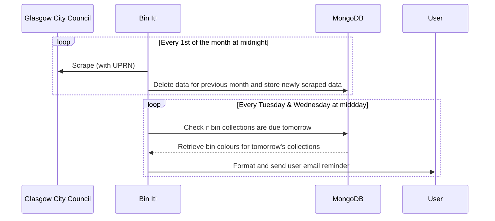

# Bin It! 🚮

Python application that scrapes the [Glasgow City Council Refuse and Recycling Calendar](https://www.glasgow.gov.uk/article/1524/Bin-Collection-Days) and sends out email alerts the day before a bin collection is due, including which bins are being collected:  

🔵 Blue - Paper, card, cardboard  
🟤 Brown - Food and garden waste  
🟢 Green - General non-recyclable household waste  
⚫️ Grey - Plastics, metals, film  
🟣 Purple - Glass  

For the most up to date information on what waste should go into which bin, refer to the Glasgow City Council article: [_What goes in your bin?_](https://www.glasgow.gov.uk/article/13729/What-goes-in-your-bin)

## Prerequisites

Docker  
Docker Compose  
Python

## Environment variables

The following environment variables are used by this project for local development. Variables not required are provided a default value in the Docker Compose configuration. Variables that are required must be defined in the `.env` file.

| Variable | Required | Description |
|----------|----------|-------------|
| `UPRN`* | Yes | UPRN (or Unique Property Reference Number) is a unique numeric identifier tied to _your_ home address. Bin collection days varies across Glasgow, your UPRN will ensure you get notifications with the correct bin collection dates. |
| `MONGO_URI` | No | Connection string to enable client to connect to database. |
| `SMTP_SERVER`** | No | Server definition based on email address being used for `sender`. |
| `SMTP_PORT` | No | Port to bind for `SMTP_SERVER`. |
| `APP_PASSWORD` | Yes| App password to authenticate `sender` email sent as automated reminders from this application. |
| `SENDER` | Yes | Email address of the sender. |
| `RECIPIENT` | Yes | Email address of the recipient. |

*[FindMyAddress](https://www.findmyaddress.co.uk/search) can be used to find out your UPRN.  

**For your own personal use, you should change this if you intend to use the app with a different email provider e.g. Outlook.  

## Processing flow



## Local development

It is highly encouraged to run this application using Docker for local development since:

- Docker containers act as a virtual environment, removing the need to manually create the virtual environment (`venv`).
- Default, non-sensitive environment variables are set in the base [Docker Compose configuration](/compose.yaml), removing the need to store and maintain as many values in the `.env` file. 

Build the container:

```
docker compose build
```

Start the container:

```
docker compose up
```

## MongoDB

### Indexes

To ensure efficient query performance, the following indexes are created on database startup:

- `bin_colours_index`: intended for more general querying to check future dates of specific bin colours.

> **As a** user  
> **I want** to occasionally query the database by `bin_colours`  
> **So that** I have the option to check future collection dates based on specific `bin_colours`.

- `date_index`: intended for use by the application itself when running cron jobs to check and send alerts when a bin collection is due.

> **As the** application  
> **I want** to routinely query the database by `date`  
> **So that** I can alert users when a bin collection is due the next day.

### Local database usage

For local development it is recommended to use [MongoDB Compass](https://www.mongodb.com/products/tools/compass) to view and query the database.
